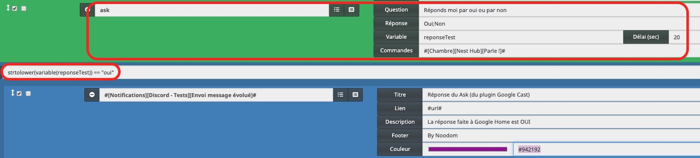
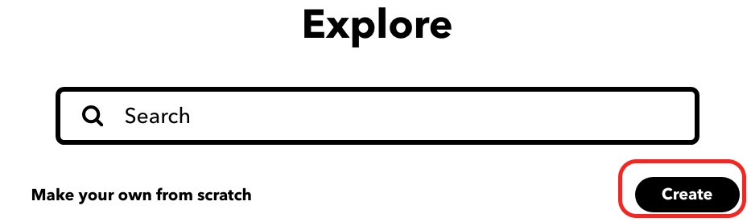
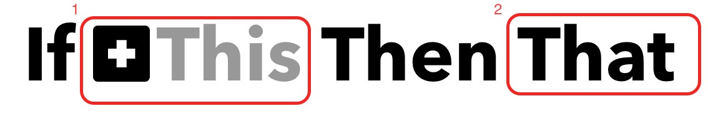
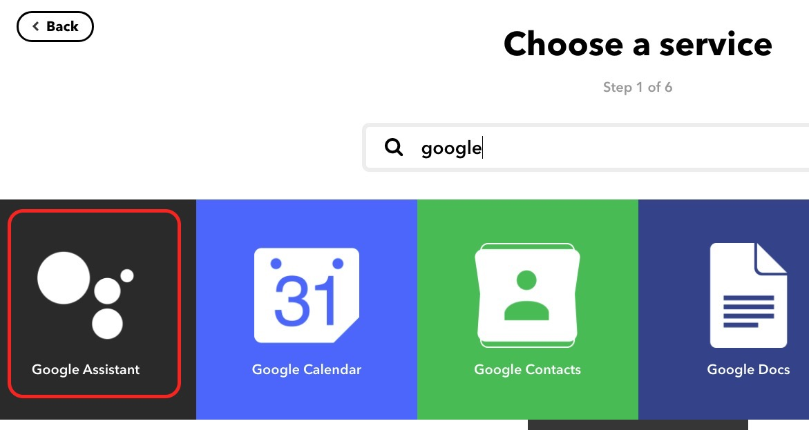
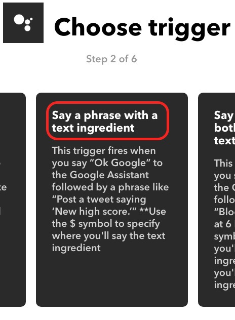
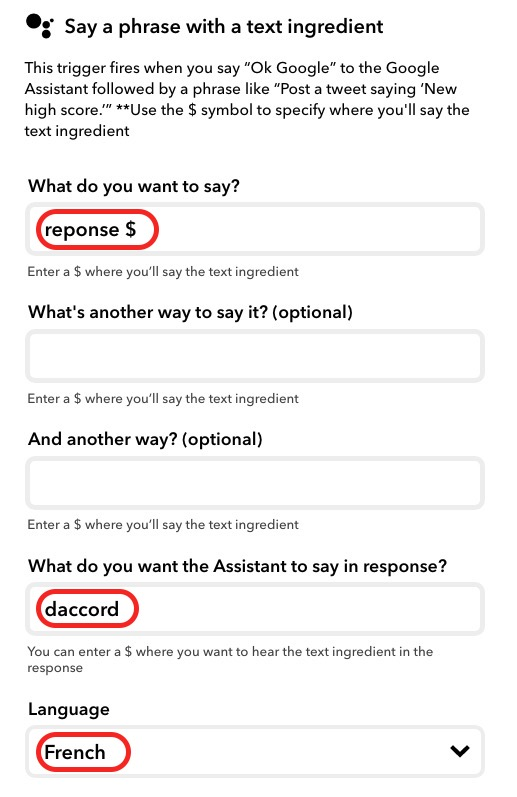
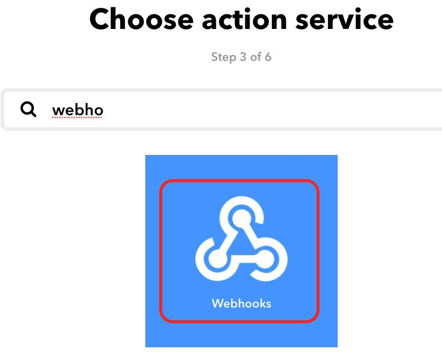
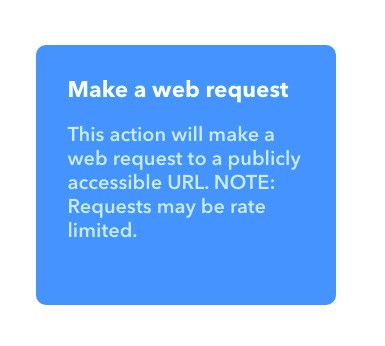
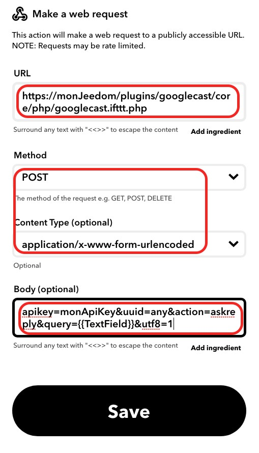
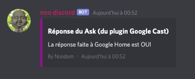

# google_home

Utilisation de Google Home pour Jeedom et Nextdom

## Répondre à une question posée par Google Home

En fonction de différents critères, Jeedom va décider de poser une question à l'utilisateur par l'intermédiaire de la Google Home.
Dans cet exemple, j'utilise la fonction Parle! par l'intermédiaire du plugin Google Cast.

### Scénario

 

- On commence par poser une question, avec par exemple pour réponses possibles oui / non
- La question est posée par l'intermédaire de la commande **Parle!** d'un équipement Google Home (déclaré dans le **plugin Google Cast**)
- Cette réponse sera stockée dans la variable **reponseTest**

- La réponse est alors testée et traitée par des IF/ALORS/SINON classiques :
    - Réponse oui : IF strtolower(variable(reponseTest)) == "oui"
        - Envoi d'une notification à Discord
    - Réponse non : IF strtolower(variable(reponseTest)) == "non"
        - ...

### Traitement de la réponse par IFTTT (ifttt.com)

- A l'exécution de la commande **Parle!**, une réponse est attendue par Jeedom
- La question est alors posée par l'intermédiaire de la Google Home
- L'utilisateur doit alors répondre avec un format spécifique (voir le format décidé lors de la création d'une applet IFTTT ci-dessous)

- Cette réponse sera envoyée par IFTTT :
    - Construction de l'applet IFTTT traitant de la réponse
        - Suivre les différentes étapes suivantes depuis la page d'accueil de ifttt.com (après avoir créé son compte)

 

 

 

Sélectionner **+This**

 

 

 

Remplir les champs et sélectionner **Create trigger**

 

Sélectionner **That**

 

 

 

Remplir les champs en remplaçant **monJeedom** par l'url de son Jeedom et **monApiKey** par sa clé API

 

Sélectionner **Finish** : L'applet de réponse est créée !

        - Il suffit maintenant d'exécuter le scénario et de répondre **OK Google réponse oui**, **OK Google réponse non**

 

>Note : Il est possible de répondre directement "OK Google oui" et "OK Google non" : il faut pour cela créer 2 applets et choisir le menu **Say a simple phrase** (au lieu de **Say a phrase with a text ingredient**)