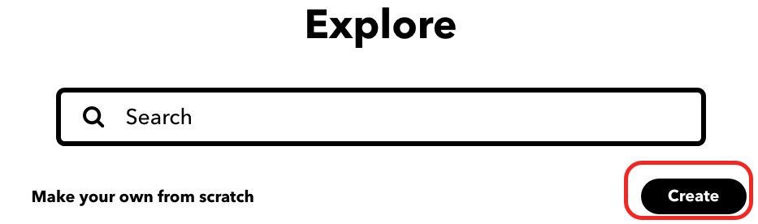
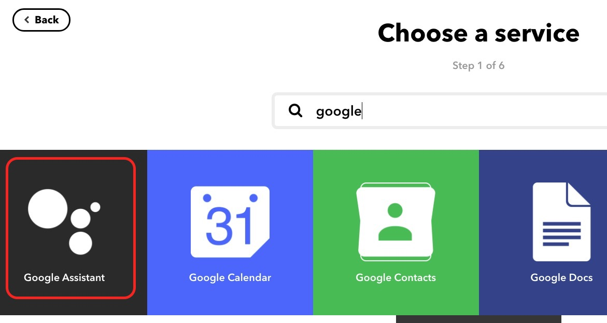
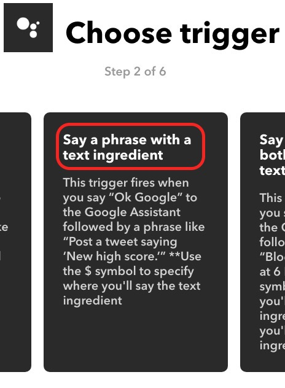
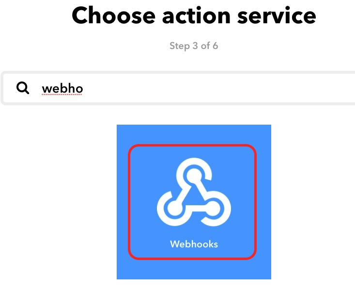

# google_home

Utilisation de Google Home pour Jeedom et Nextdom

## Envoyer un message par Google Home et le répéter par Google Home en différé

- On dit à Google Home d'envoyer un message avec le mot-clé "Envoie" en début de message :
    **"Envoie On fait un resto ce soir".**

- Google Home répond **"message enregistré"**

- Sur événement (arrivée d'une personne), un scénario lance le message différé sur Google Home

Dans cet exemple, j'utilise la fonction **Parle!** par l'intermédiaire du plugin **Google Cast**.

### Traitement de l'envoi du message différé par IFTTT (ifttt.com)

- Lorsqu'on parle à Google Home en commençant par le mot-clé "Envoie", l'applet IFTTT est déclenchée

- L'applet prend en compte le message à envoyer en différé (**caractère $**)

- IFTTT appelle alors le scénario pour enregistrer le message avec le tag msg qui contient le message

    - Construction de l'applet IFTTT traitant de la réponse
        - Suivre les différentes étapes suivantes depuis la page d'accueil de ifttt.com (après avoir créé son compte)

 

 

 

- Sélectionner **+This**

 

 

 

Remplir les champs et sélectionner **Create trigger**

 

Sélectionner **That**

 

 

 

Remplir les champs en remplaçant **monJeedom** par l'url de son Jeedom, **monApiKey** par sa clé API,
    et **123** par l'identifiant du scénario pour enregistrer le message différé (capture ci-dessous)

 

- Sélectionner **Finish** : L'applet de réception du message est créée !

- Ce message est ensuite envoyé à Jeedom :

   - Le scénario d'enregistrement du message différé (id=123 dans l'exemple) est alors déclenché

   - Il reste ensuite à créer un scénario qui sera exécuté par un déclenchement de son choix (arrivée d'une personne, heure définie, ..)

>Notes :
>- Attention à bien reprendre l'id du scénario d'enregistrement du message différé dans l'applet IFTTT
>- la variable **messagePresent** permet de faire l'annonce du message différé seulement si un message a été envoyé
>- Ce tutorial peut être amélioré en gérant plusieurs messages. Actuellement, seul le dernier message sera annoncé (les précédents seront écrasés)
